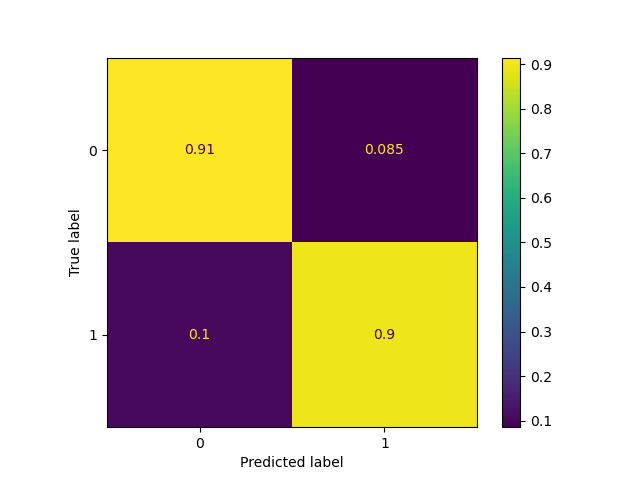
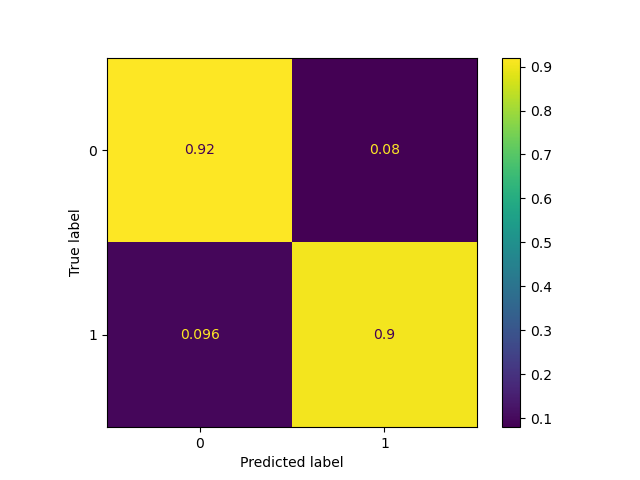

# Star Classification : Random 

This project shows the comparison in different Classification Algorithms, in this project we are directly 
comparing Forest Classification and Support Vector Classification.

## Dataset

- https://www.kaggle.com/datasets/vinesmsuic/star-categorization-giants-and-dwarfs?select=Star3642_balanced.csv
- Name : Star Dataset for Stellar Classification
- Author : Vinesmsuic

## File Overview

- `Optimal Star SVC.py` : Finds optimal `C` and `Gamma` variables for SVC through use of Grid Search.
- `Optimal Start Forest.py` : Finds optimal `n_estimators` and `max_depth` for RFC through use of Grid Search
- `star_class_data.csv` : Full Dataset from Kaggle.
- `Random Forest Vs SVC.py` : This file computes both SVC and RFC, directly comparing them
- `SVC_confusion.png` : Confusion Matrix of Support Vector Classifier
- `forest_confusion.png` : Confusion matrix of Random Forest Classifier
- `README.md` : Your reading it right now!

## Model Overview
Dataset was split into 70% train and 30% test

- Features :
  - `Vmag`
  - `Plx`
  - `e_Plx`
  - `B-V`
  - `Amag`
- Label :
  - `TargetClass`

# Random Forest Classifier

- Parameters :
  - Support Vector Classification
    - `C` : 8
    - `Kernel` : Radial Basis Function (rbf)
    - `Gamma` : 0.24
  - Random Forest Classification
    - `max_depth` : 7
    - `n_estimator` : 20

## Results
Both models performed fairly well in terms of both accuracy and Mean Squared Error, both landing around 90%. After testing multiple times however
it does seem that Support Vector Classification tends to outperform Random Forest Classification on average. 

Random Forest Classification

 

Support Vector Classification

SVC Score (Train): 0.905                                                                                                                   
SVC Score (Test): 0.902

Forest Score (Train): 0.930                                                                                                               
Forest Score (Test): 0.895

